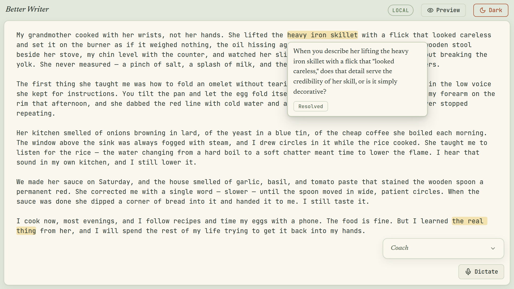
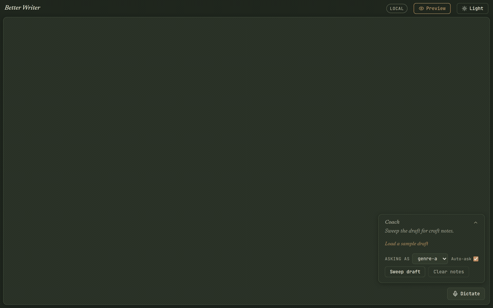

# Better Writer

You write. It asks you one question about what you just wrote. It never touches your words.

Here is a real question the app pinned to a real sentence, using the sample draft it ships with:

> **You wrote:**
> My grandmother cooked with her wrists, not her hands. She lifted the heavy iron skillet with a flick that looked careless and set it on the burner as if it weighed nothing.
>
> **It asked:**
> When you describe her lifting the heavy iron skillet with a flick that "looked careless," does that detail serve the credibility of her skill, or is it simply decorative?

The question stays attached to your sentence until you dismiss it. There is no chat window, no suggested rewrite, no "here is a better version." You do all the writing.

**[Try it in your browser →](https://micahchoo.github.io/better-writer/)** No install, no account, no key.

<picture>
  <source media="(prefers-color-scheme: dark)" srcset="docs/assets/editor-dark.png">
  <source media="(prefers-color-scheme: light)" srcset="docs/assets/editor-light.png">
  
</picture>

## What the coach can do

The coach displays questions as annotations. It has no operation that changes your draft.
Every model question starts with a candidate from the craft bank.
The prompt asks the model to explore your writing choices without advice or replacement prose.

Code checks the question format and its exact evidence quote before displaying it.
Those checks do not prove that a question is useful or preserves the seed's intent.
If no candidate fits, the coach can ask nothing.
There is no account, telemetry, or server of ours between you and your words.

**Where your words go.** With no model, or with your own model on your own machine, nothing leaves it. If you connect your own API key, that changes: the paragraph around your cursor goes to the provider you picked, and **Sweep draft** sends the whole draft that way, one window at a time. Dictation audio goes to the same provider. That is what the key is for, and you pay for every call. Your draft *file* is never uploaded in any mode — it lives in your browser or on your disk.

## Installation

You need [Node](https://nodejs.org) 20 or later.

```bash
git clone https://github.com/micahchoo/better-writer.git
cd better-writer
npm install
npm run dev
```

Open the address the terminal prints. This is the same demo as the link above: no model, no setup.

To get questions written in your own words, you need a model. See [Choose how it thinks](#choose-how-it-thinks).

## Getting started

The app opens on an empty page.

1. Click **Load a sample draft** if you want prose to try it on. Or start typing your own.
2. Keep writing. After about 30 new words and a 20-second pause, the coach checks for a suitable question.
3. Click any highlighted phrase to read its question.
4. Revise until the question is no longer true, then click **Resolved** to dismiss it.

To question a whole draft at once, click **Sweep draft**. It checks each window and pins questions with exact evidence. Some windows produce no question. **Stop** cancels pending requests. **Clear notes** removes them all.



Set **asking as** to your genre — fiction, creative-nonfiction, memoir, essay, poetry, or genre-agnostic. It changes which questions you are asked.

> [!NOTE]
> **Sweep draft** appears once a model is connected. The **Auto-ask** switch appears only when the model runs on your own machine. In the no-model demo, questions still arrive on their own after a pause.

## Choose how it thinks

| | No model | Your own model | Your own key |
|---|---|---|---|
| **What you get** | A question from the bank, exactly as written | An applicable craft question with an exact quote | The same agent through your provider |
| **You need** | Nothing | A model server on your machine | An API key |
| **Initial draft location** | In your browser | `data/drafts/current.md` | In your browser |
| **Your prose leaves your machine** | Never | Never | Yes — to your provider |

The app detects its initial connection and remembers the document location.
Changing or disconnecting an API key keeps the current draft, annotations, and storage destination.
The BYOK settings are also available with a local model.
Browser saves store the draft and annotations together. Older browser drafts remain readable.

**Your own model.** Run [llama.cpp](https://github.com/ggml-org/llama.cpp) or [Ollama](https://ollama.com) on `127.0.0.1:8088`, then:

```bash
npm start      # serves http://127.0.0.1:4517
```

**Your own key.** Click the key icon in the top bar and pick OpenRouter, OpenAI, Groq, or any OpenAI-compatible URL, then enter your model and key. The key is kept in your browser and is sent only to the base URL you named.

Dictation works with a local Parakeet model, or through your provider's transcription endpoint. OpenRouter serves no audio route, so on OpenRouter the **Dictate** button hides rather than fail.

## Where the questions come from

A bank of 1,759 craft questions written for this project, each tagged by genre and by the kind of change it asks for:

| Asks you to | Questions |
|---|---|
| rewrite | 606 |
| form a concept | 422 |
| cut | 230 |
| elaborate | 202 |
| rephrase | 125 |
| transition | 109 |
| elucidate | 65 |

The bank supplies the craft questions. The model selects an applicable candidate and reshapes it around an exact detail from your passage.
Seed IDs, verbs, and source books never enter the model prompt.

<details>
<summary>How one question gets chosen</summary>

Local and BYOK modes use the same selection policy.
The app measures dialogue, sentence rhythm, hedges, filter words, abstract nouns, and section position.
These signals give some intervention kinds a soft preference.
The draw selects up to three distinct questions and favors different intervention kinds within that small set.

The model selects one applicable candidate or abstains.
It returns a question and an exact quote from the focus block.
Code checks the output shape, question format, quote spelling, quote uniqueness, and quote use in the question.
Code also rejects copied seed wording and passage echoes. It computes annotation offsets from the quote.

Invalid output gets one corrective retry that includes the rejected response.
A second failure produces no annotation. A connection failure appears separately from a passage with no suitable question.
Automatic coaching remains quiet on failure. A sweep reports unavailable windows.

The full vocabulary is in [CONTEXT.md](CONTEXT.md).
The session design is in [ADR 0009](docs/adr/0009-document-and-coaching-sessions.md).

</details>

## Settings

Copy [`.env.example`](.env.example) to `.env` and edit it.

| Variable | Default | What it does |
|---|---|---|
| `BW_LLM_BASE_URL` | `http://127.0.0.1:8088/v1` | Your local model endpoint |
| `BW_LLM_MODEL` | `bonsai-27b` | Which model to ask |
| `BW_HOST` | `127.0.0.1` | Address the server binds to |
| `BW_PORT` | `4517` | Port the server binds to |
| `BW_STT_MODEL_DIR` | unset | Parakeet folder override; dictation also accepts the default model cache |

## Development

```bash
npm test           # unit suite
npm run typecheck  # tsc --noEmit
npm run build      # static build into dist/
npm run eval:agent # synthetic fixtures against Bonsai on port 8088
```

The editor is built on [CodeMirror 6](docs/adr/0008-cm6-editor-substrate.md). Architectural decisions have short records in [docs/adr/](docs/adr/).

## Contributing

Issues and pull requests are welcome. Three rules hold:

- The model runs on the writer's machine or on their own key. Never ours.
- The model never writes into the draft.
- Seed provenance stays invisible: it reaches neither the writer nor the model.

Run `npm test && npm run typecheck` before you open a pull request.

## License

MIT. See [LICENSE](LICENSE).
