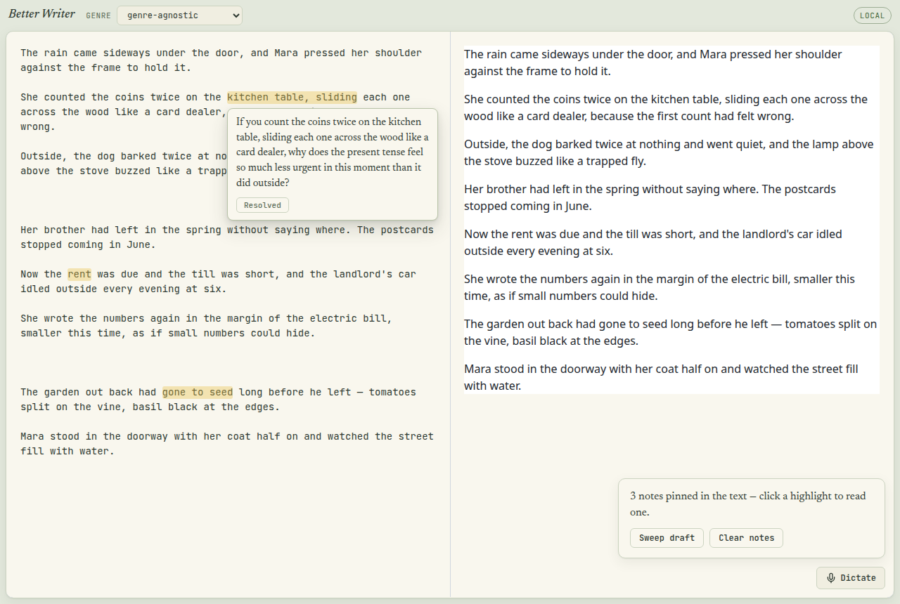

# Better Writer

[](#the-sweep)

An agent-backed Markdown editor that asks one sharp craft question about the
text around your cursor — and never writes a word for you.

## Why

Writing coaches help most when they ask instead of tell. Better Writer pins
that idea to your text: it highlights the exact span a question is about, in
your draft, beside your words. The model has one job — ask. It never drafts,
never edits, never explains.

## Features

- **One question at a time** — ask when you want a fresh eye; the question
  anchors to the block under your cursor.
- **Sweep the whole draft** (local mode) — the coach reads non-overlapping
  3-block windows and pins one note per window as answers arrive.
- **Click-to-open notes** — every sweep note paints a marker tint; click one
  to read its question in a popover. One popover open at a time.
- **Seed bank of 1,258 craft questions** extracted verbatim from Le Guin's
  *Steering the Craft*, Stein's *Stein on Writing*, and Alberts' *Showing &
  Telling*.
- **Mechanically gated model output** — a deterministic gate rejects anything
  that is not a single grounded question, retries once with a reason-specific
  nudge, then falls back to a topic probe.
- **Local dictation** — press-to-talk with a local Parakeet speech model
  (optional).
- **Two modes, zero config to switch** — the client probes `/health` on load
  and picks static or local by itself.



## Installation

```bash
git clone <repo-url>
cd better-writer
npm install
```

Requirements: Node 20+, npm. Local mode additionally needs any
OpenAI-compatible completion server (llama.cpp, Ollama) on `127.0.0.1:8088`.

## Quickstart

Static demo — no model, no server. The coach asks random seed questions
verbatim; drafts persist in the browser:

```bash
npm run dev
```

Full mode — build, serve, and reshape each seed against your live text with
one local model:

```bash
npm start
```

Then open http://127.0.0.1:4517. Write a few sentences, click **Ask now**,
and answer by revising. With a model attached you can also click **Sweep
draft** to pin notes across everything you wrote.

## Usage

### Ask about the text around your cursor

1. Put the caret in the paragraph you want coaching on.
2. Click **Ask now** (bottom panel).
3. A highlight appears over the phrase the question is about; revise until it
   stops being true, then dismiss.

### Sweep the whole draft

1. Click **Sweep draft**. The coach walks the draft in non-overlapping
   3-block windows.
2. Notes appear progressively — one highlight per window whose answer could
   be anchored inside that window. Answers that never ground in their own
   window are dropped silently.
3. Click any tinted fragment to read its question; click again to close. The
   ✕ button or **Clear notes** removes notes.

Drafts save automatically: to `data/drafts/current.md` in local mode, to
browser localStorage in static mode.

## Configuration

| Variable | Default | What it does |
|---|---|---|
| `BW_LLM_BASE_URL` | `http://127.0.0.1:8088/v1` | OpenAI-compatible endpoint |
| `BW_LLM_MODEL` | `bonsai-27b` | Model id |
| `BW_STT_MODEL_DIR` | — | Local Parakeet STT dir; dictation hidden without it |
| `BW_HOST` / `BW_PORT` | `127.0.0.1` / `4517` | Bind address |

Real environment variables win over a `.env` file — see `.env.example`.

<details>
<summary>How the two modes differ</summary>

| | Static | Local |
|---|---|---|
| Server | none | Hono + node:http on `4517` |
| Question source | random seed, verbatim | seed pulled by genre, reshaped by the model |
| Anchoring | block under the cursor | longest distinctive-word match near the anchor policy tiers |
| Draft storage | browser localStorage | `data/drafts/current.md` |
| Sweep button | hidden | available |

</details>

## Development

```bash
npm test           # unit suites: gate, reshape, seed, text-window, trigger, coach-sweep
npm run typecheck  # tsc --noEmit
npm run build      # static build to dist/ (relative paths, GitHub Pages ready)
```

The architecture seams are documented in `CONTEXT.md`, and the decisions
behind them in `docs/adr/` — start with `0005-model-output-mechanically-gated`
and `0006-static-demo-mode-with-fake-coach`.

## Contributing

Issues and pull requests welcome. Keep the discipline: local models only, no
hosted APIs; the model composes freely but commits nothing; seed provenance
never reaches the model or the page. Run `npm test && npm run typecheck`
before opening a PR.

## License

MIT — see [LICENSE](LICENSE).
